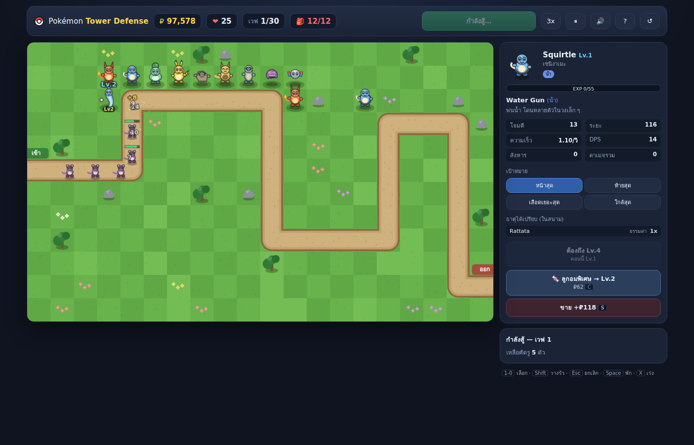

# Poke Defense

**เล่นเลย → https://elixirmvii.github.io/Poke-defense/**

เกม tower defense แนวโปเกม่อน เล่นบนเบราว์เซอร์ล้วน ๆ ไม่ต้องติดตั้งหรือ build อะไรเลย
รองรับทั้งเมาส์คีย์บอร์ดและการแตะบนแท็บเล็ต

ไม่ได้ซื้อโปเกม่อนด้วยเงิน — ต้อง **ออกไปจับเอง** ที่โซนซาฟารี แล้วพกลงด่านได้ **สูงสุด 6 ตัว**
ตามกฎจริงของโปเกม่อน มี Gen 1 ครบ 151 ตัว ใช้สไปรท์จริงแบบเคลื่อนไหวชุด Black/White
พร้อม **เมก้าอีโวลูชัน** และ **เควสพิเศษสำหรับโปเกม่อนในตำนาน**

และที่สำคัญที่สุด: **ค่าพลังทุกอย่างคำนวณจากสเตตัสจริง** ไม่ได้ตั้งมือทีละตัว



## เล่นยังไง

เปิด https://elixirmvii.github.io/Poke-defense/ ได้เลย

หรือถ้าจะรันเองในเครื่อง แนะนำให้เสิร์ฟผ่าน http เพื่อให้สไปรท์ **เคลื่อนไหว** ได้:

```bash
npx serve .          # แล้วเปิด http://localhost:3000
```

เปิด `index.html` ตรง ๆ ด้วยการดับเบิลคลิกก็เล่นได้ แต่หน้า `file://` เรียก `fetch` ไม่ได้
ตัวเกมจะถอยไปใช้สไปรท์ภาพนิ่งแทน (ยังเป็นรูปจริงเหมือนเดิม แค่ไม่ขยับ)

ความคืบหน้าเซฟลง `localStorage` ของเบราว์เซอร์อัตโนมัติ

**บน iPad / iPhone** — เปิดด้วย Safari แล้วกดปุ่มแชร์ → *เพิ่มลงในหน้าจอโฮม*
จะได้เปิดแบบเต็มจอเหมือนแอป และช่วยไม่ให้ Safari ล้างเซฟทิ้ง
การเล่นด้วยการแตะรองรับครบ: แตะช่องที่อยากไปในซาฟารี แตะตัวในทีมแล้วแตะสนามเพื่อวาง

## วงจรของเกม

```
เลือกตัวเริ่มต้น → โซนซาฟารี (จับ) → จัดทีม 6 ตัว → ด่านแคมเปญ (ป้องกัน)
                       ↑                                      ↓
                       └──── เงิน · ลูกบอล · หินเมก้า ────────┘
                                      ↓
                         เควสโปเกม่อนในตำนาน (5 ตัว)
```

**โซนซาฟารี 6 แห่ง** — ทุ่งหญ้า ป่า เมือง ริมทะเลสาบ ถ้ำ ภูเขาไฟ
แต่ละโซนดึงรายชื่อจาก **ถิ่นอาศัยจริง** (`habitat`) ของ Gen 1 เลยเจอตัวที่สมเหตุสมผลกับสถานที่
เดินบนหญ้าสูงด้วยลูกศร/WASD หรือคลิกช่องที่อยากไป

**การจับแบบ Safari Zone จริง** — ไม่มีการต่อสู้ มีแค่ขว้างบอล โยนเหยื่อ ขว้างก้อนหิน หรือหนี
โอกาสจับคำนวณจาก **อัตราการจับจริง** ของแต่ละตัว (Caterpie 255 = ง่ายสุด, Mewtwo 3 = ยากสุด)

| การกระทำ | ผล |
|---|---|
| โยนเหยื่อ | มันมัวกิน — หนียากขึ้น แต่จับยากขึ้นด้วย |
| ขว้างก้อนหิน | มันโกรธ — จับง่ายขึ้นมาก แต่หนีง่ายขึ้นมากด้วย |

**ด่านแคมเปญ 6 ด่าน** บน 3 แผนที่ ศัตรูดึงจากถิ่นอาศัยของด่านนั้น ผ่านแล้วได้เงิน ลูกบอล และหินเมก้า
เลเวลที่โปเกม่อนได้ระหว่างสู้ **ติดตัวไปด่านถัดไป**

**เควสในตำนาน 5 ตัว** — Articuno, Zapdos, Moltres, Mewtwo, Mew
ปลดล็อกตามจำนวนด่านที่ผ่านและสายพันธุ์ที่จับได้ (Mew ต้องจับให้ได้ 75 สายพันธุ์)
ในเควส ตัวในตำนานเดินผ่านสนามรอบเดียว ต้อง **กดเลือดให้ต่ำกว่าเกณฑ์ก่อนมันเดินพ้นสนาม** ถึงจะจับได้

## เมก้าอีโวลูชัน

ต้องมี **หินเมก้า** ของสายพันธุ์นั้น (ได้จากการผ่านด่าน หรือซื้อที่ร้าน ₽5,000)
แล้วกดในสนามรบ — **ได้ครั้งเดียวต่อด่าน และทีละตัวเท่านั้น** จบด่านกลับร่างเดิม

ร่างเมก้าใช้ **สเตตัสจริงของร่างนั้นทั้งชุด** ไม่ใช่บวกเปอร์เซ็นต์ บางร่างเปลี่ยนธาตุด้วย

Gen 1 มีร่างเมก้าทางการ **15 ร่างจาก 13 สายพันธุ์** — Venusaur, Charizard (X/Y), Blastoise,
Beedrill, Pidgeot, Alakazam, Slowbro, Gengar, Kangaskhan, Pinsir, Gyarados, Aerodactyl, Mewtwo (X/Y)

> PokeAPI มีร่างเมก้าอื่นปนมาด้วย (Raichu, Clefable, Starmie, Dragonite) ซึ่งไม่ใช่ของ Game Freak
> ตัวสร้างข้อมูลกรองออกด้วยรายการ id ที่กำหนดไว้ชัดเจน

## ค่าพลังมาจากสเตตัสจริง

หัวใจของงานนี้ — ตั้งค่าพลังมือ 151 ตัว (+15 ร่างเมก้า) ทำไม่ไหวและจะไม่มีวันสมดุล
ทุกอย่างคำนวณใน `js/derive.js`:

| สเตตัสจริง | กลายเป็นอะไรในเกม |
|---|---|
| max(Atk, SpA) | พลังโจมตี |
| Spe | ความเร็วในการยิง |
| SpA / (Atk+SpA) | ระยะโจมตี — เอนไป SpA = ยิงไกล, Atk นำ = ประชิดตีรัว |
| BST | ราคา (โตแบบกำลังสอง) |
| HP, Def, SpD | ความอึดตอนเป็นศัตรู |
| Def | เกราะ (ลดดาเมจแบบสัดส่วน `dmg × 60/(60+armor)`) |
| capture_rate | โอกาสจับในซาฟารี |
| habitat | โซนซาฟารีที่เจอได้ |
| ธาตุหลัก | รูปแบบการโจมตีและสถานะผิดปกติ |

ผลคือ Alakazam ยิงไกลมากแต่บาง, Machamp ต้องยืนติดทางแต่ DPS โหด, Onix เกราะหนาจนป้อมเบาเจาะไม่เข้า
— ตรงกับที่ควรจะเป็นโดยไม่ต้องจูนทีละตัว

**ธาตุ** คิดจากตารางจริงครบ 18 ธาตุ ศัตรูสองธาตุคูณตัวคูณซ้อนกัน
คู่ที่ปกติ "ไม่ได้ผลเลย" ยกพื้นเป็น 0.25 เท่า เพื่อไม่ให้ตัวที่เลี้ยงมาไร้ประโยชน์สนิท

**วิวัฒนาการ** เลเวลที่ต้องใช้อิงของจริง (Charmander วิวัฒน์ที่ 16 → ในเกมนี้ Lv.4,
Dragonair ที่ 55 → Lv.13) ตัวที่ใช้หินหรือแลกเปลี่ยนมีเงื่อนไขของตัวเอง Eevee เลือกได้ 3 ทาง

## โครงสร้างไฟล์

```
index.html         หน้าเกม โหลดสคริปต์ตามลำดับ (ไม่ใช้ ES module จะได้เปิดจาก file:// ได้)
css/style.css
js/types.js        ตารางธาตุ 18x18 + สีประจำธาตุ
js/gen1.js         ข้อมูล Gen 1 ครบ 151 ตัว + ร่างเมก้า 15 ร่าง — สร้างอัตโนมัติ ห้ามแก้มือ
js/derive.js       แปลงสเตตัสจริง -> ค่าพลังในเกม (ค่าจูนอยู่ในบล็อก TUNE)
js/sprites.js      โหลดและวาดสไปรท์จริง ถอดเฟรม GIF เองด้วย ImageDecoder
js/save.js         เซฟลง localStorage: กล่อง ทีม เงิน ลูกบอล หิน ด่านที่ผ่าน เควส + ร้านค้า
js/map.js          แผนที่สนามรบ 3 แบบ เส้นทางเดิน และการวาดฉาก
js/waves.js        ตัวสร้างเวฟ (รับพารามิเตอร์ต่อด่าน)
js/campaign.js     นิยามด่าน 6 ด่าน และเควสในตำนาน 5 เควส
js/safari.js       โซนซาฟารี: แผนที่เดินได้ + มินิเกมจับ
js/audio.js        เสียงสังเคราะห์ด้วย WebAudio (ไม่มีไฟล์เสียง)
js/entities.js     คลาสศัตรู / ป้อม (รวมเมก้า) / กระสุน / เอฟเฟกต์
js/game.js         หน้าจอต่อสู้: สถานะ ลูป การคิดดาเมจ
js/ui.js           ทุกหน้าจอ: starter · world · party · dex · safari · battle
js/app.js          ตัวจัดการหน้าจอและลูปกลาง
tools/             สคริปต์สร้างข้อมูล ทดสอบ และปรับบาลานซ์ (ไม่เกี่ยวกับตัวเกม)
```

### เรื่องภาพ

ใช้สไปรท์จริงชุด **Black/White แบบเคลื่อนไหว** จาก
[PokeAPI/sprites](https://github.com/PokeAPI/sprites) (ร่างเมก้าเป็นภาพนิ่ง เพราะเป็นของ Gen 6)

**รูปไม่ได้ถูกเก็บไว้ในรีโปนี้** — โหลดสดจาก CDN ตอนเล่น เฉพาะตัวที่โผล่บนจอจริง ๆ

เบราว์เซอร์ส่วนใหญ่ไม่เดินเฟรม GIF ให้ตอนวาดลง `<canvas>` (ได้แค่เฟรมแรกค้าง)
`js/sprites.js` เลยถอดเฟรมเองด้วย `ImageDecoder` (WebCodecs) แล้วคุมเวลาเอง
ไม่รองรับก็ถอยไปใช้ PNG ภาพนิ่ง และระหว่างรอโหลดวาดลูกบอลสีธาตุคั่นไว้

**เล่นออฟไลน์** — โหลดรูปมาไว้เองแล้วชี้ไปที่โฟลเดอร์นั้น:

```html
<script>window.PTD_SPRITE_BASE = './sprites';</script>   <!-- วางก่อน js/sprites.js -->
```

โครงสร้างที่ต้องมี: `<base>/<id>.png` และ `<base>/versions/generation-v/black-white/animated/<id>.gif`

ตัวละครผู้เล่นในซาฟารีวาดด้วยโค้ดบน canvas (ไม่มีสไปรท์เทรนเนอร์ในคลังที่ใช้อยู่)

## เครื่องมือ

```bash
npm install playwright                    # ครั้งเดียว

node tools/gen-pokedex.js <โฟลเดอร์ csv>   # สร้าง js/gen1.js ใหม่จากข้อมูล PokeAPI
node tools/smoke.js                       # เล่นทั้งวงจรอัตโนมัติ จับ error + เก็บภาพ
node tools/touch.js                       # ทดสอบด้วยการแตะอย่างเดียวบนจอขนาด iPad
node tools/balance.js best                # จำลองเล่นทั้งแคมเปญ ดูว่าบาลานซ์โอเคไหม
node tools/build-artifact.js <โฟลเดอร์รูป> # รวมเป็นหน้าเว็บไฟล์เดียวที่พึ่งพาตัวเองได้
node tools/check-dist.js                  # ตรวจว่าหน้าที่รวมแล้วยังเล่นได้และไม่เรียกเน็ตนอก
```

### การเผยแพร่

เว็บที่เปิดอยู่เสิร์ฟจาก branch **`gh-pages`** ไม่ใช่ `main`
(GitHub เปิด Pages ให้อัตโนมัติตอนมี branch ชื่อนี้โผล่มาครั้งแรก)
อัปเดตเว็บหลังแก้โค้ดแล้ว:

```bash
git push origin main
git push origin main:gh-pages    # อันนี้คืออันที่ทำให้เว็บเปลี่ยน
```

### สร้างเวอร์ชันที่พึ่งพาตัวเองได้

`tools/build-artifact.js` รวม CSS กับ JS ทั้งหมดเข้าไปในไฟล์เดียว และแนบสไปรท์ไปด้วย
สำหรับกรณีที่เอาไปวางบนที่ที่บล็อกการโหลดรูปจากโฮสต์ภายนอก (เช่น CSP เข้ม ๆ) หรืออยากเล่นออฟไลน์

ผลลัพธ์อยู่ใน `dist/` (ไม่ได้เก็บเข้ารีโป เพราะมีไฟล์สไปรท์ฝังอยู่):

```
dist/index.html          235 KB  — CSS + JS 14 ไฟล์รวมอยู่ในนี้หมด
dist/sprites/<id>.png    166 รูป — ภาพนิ่ง ใช้ใน DOM และเป็นตัวสำรอง
dist/sprites/anim.b64.txt        — GIF เคลื่อนไหว 151 ตัวต่อกันแล้วเข้ารหัส base64
dist/sprites/anim.json           — ดัชนีบอกตำแหน่งของแต่ละตัวในไฟล์ข้างบน
```

ที่ต้องแพ็ก GIF รวมกันเพราะบางที่จำกัดจำนวนไฟล์แนบ และที่ต้องเป็น base64 ในไฟล์ `.txt`
เพราะหลายที่เสิร์ฟเฉพาะชนิดไฟล์มาตรฐานของเว็บ `.bin` จึงใช้ไม่ได้

ตัวเกมจะขึ้น **ภาพนิ่งก่อนทันที** แล้วค่อยอัปเกรดเป็นภาพเคลื่อนไหวเมื่อแพ็กโหลดเสร็จเบื้องหลัง
ถ้าโหลดแพ็กไม่ได้ก็ยังเล่นได้ด้วยภาพนิ่งตามปกติ

`tools/balance.js` จำลองตั้งแต่เลือกตัวเริ่มต้น → จับโปเกม่อนในโซนที่ปลดล็อก → จัดทีม
→ ลงด่านทีละด่าน → ลองเควส แล้วรายงานว่าด่านไหนผ่าน DPS เท่าไหร่ และ **ตัวไหนหลุดเข้าฐาน**
(อันหลังมีประโยชน์ที่สุดตอนหาว่าอะไรพัง)

ผลที่ควรได้ด้วยค่าปัจจุบัน:

| กลยุทธ์ | ผล |
|---|---|
| `best` (เลือกทีมให้ธาตุครอบคลุมและ DPS สูง) | ผ่านครบ 6 ด่าน แต่สองด่านท้ายเหลือแค่ ~6/16 หัวใจ |
| `starter` / `random` (ไม่คิดเรื่องธาตุ) | ตายที่ด่าน 4 |
| เควสในตำนาน | ผ่านแบบเฉียดฉิว (กดเลือดได้ 18–24% จากเกณฑ์ 20–25%) |

ถ้าแก้ค่าใน `TUNE` หรือ `campaign.js` แล้วตารางนี้เพี้ยนไปมาก แปลว่าบาลานซ์หลุด

## อยากแก้อะไรต่อ

- **ปรับสมดุลรวม** — บล็อก `TUNE` ที่หัว `js/derive.js`
- **ปรับความยากรายด่าน** — `STAGES` ใน `js/campaign.js` (`hpFrom`/`hpPow`/`hpK`/`countStep`)
- **เปลี่ยนบุคลิกของธาตุ** — ตาราง `STYLE` ใน `js/derive.js` แก้ที่เดียวมีผลกับทุกตัวธาตุนั้น
- **เพิ่มโซนซาฟารี** — `ZONES` ใน `js/safari.js` (ระบุ `hb` = habitat id ที่จะเจอ)
- **เพิ่มแผนที่สนามรบ** — `LAYOUTS` ใน `js/map.js` ใส่จุดหักเลี้ยวกับโทนสี ที่เหลือคำนวณเอง
- **เพิ่มเควส** — `QUESTS` ใน `js/campaign.js`
- **เพิ่ม Gen 2+** — `tools/gen-pokedex.js` กรอง `generation_id === '1'` อยู่ เอาเงื่อนไขออกก็ได้ครบทุกเจน
  (สไปรท์เคลื่อนไหวชุด BW มีถึง id 649)

---

เกมนี้เป็นงานอดิเรกส่วนตัวที่ไม่แสวงหากำไร ไม่ได้เกี่ยวข้องกับ Nintendo, Game Freak
หรือ The Pokémon Company แต่อย่างใด

Pokémon ชื่อตัวละคร สไปรท์ และค่าสเตตัสทั้งหมดเป็นทรัพย์สินของเจ้าของลิขสิทธิ์
รีโปนี้มีแต่โค้ดเกม — **ไม่ได้เก็บหรือแจกจ่ายไฟล์สไปรท์ใด ๆ** ตัวเกมโหลดรูปสดจาก
[PokeAPI/sprites](https://github.com/PokeAPI/sprites) ตอนเล่น
ส่วนข้อมูลสเตตัส อัตราการจับ และถิ่นอาศัย มาจากชุดข้อมูลของ
[PokeAPI](https://github.com/PokeAPI/pokeapi)
